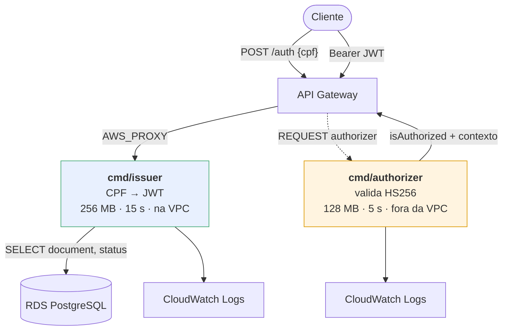
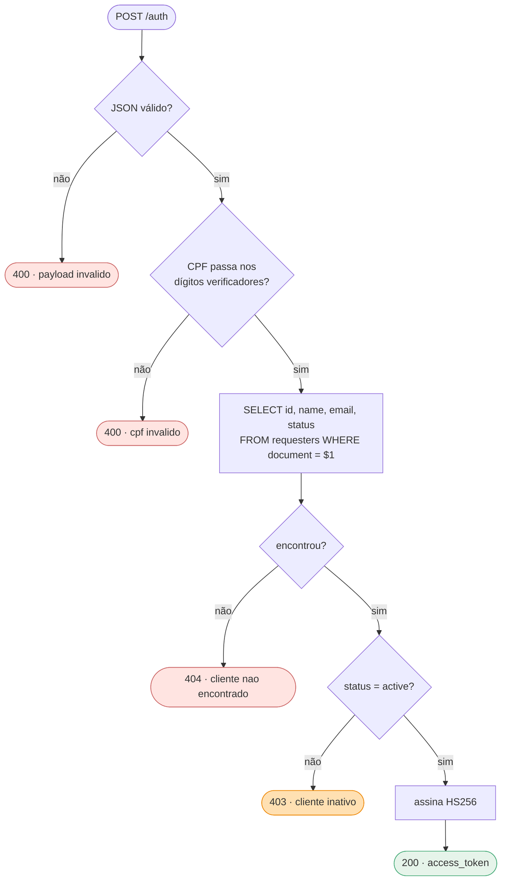
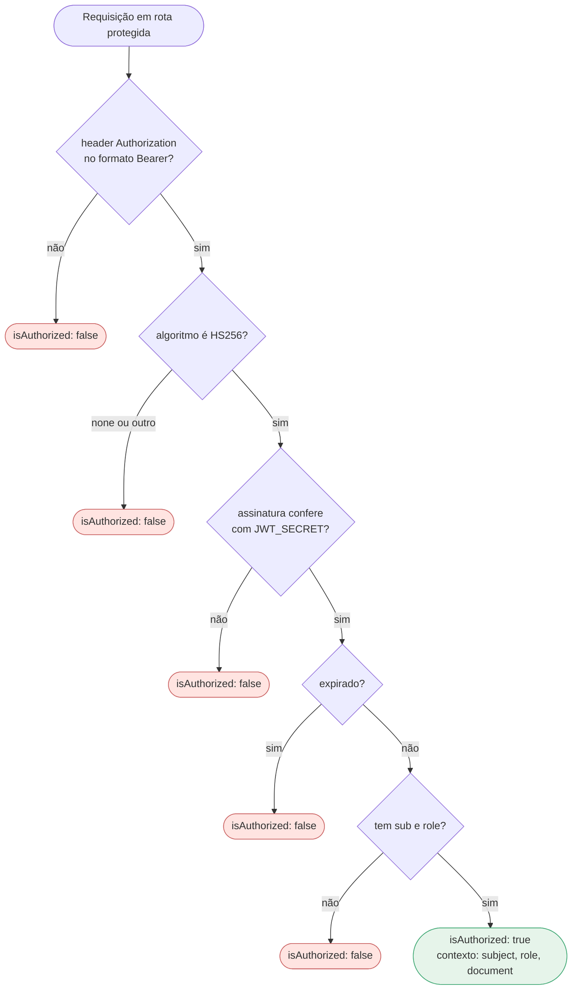
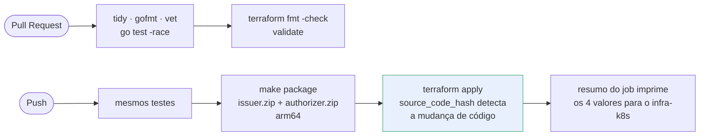

# postech-tc3-lambda-auth

**Function serverless de autenticação por CPF** do sistema de gestão de oficinas mecânicas.

Tech Challenge Fase 3 — FIAP Pós Tech SOAT.

## Propósito

Recebe um CPF, valida o número, consulta a existência e o status do cliente no banco gerenciado e devolve um **JWT** para consumo das APIs protegidas atrás do API Gateway.

## Tecnologias

- Go 1.23 rodando em AWS Lambda (runtime `provided.al2023`, arm64)
- `golang-jwt/v5` para emissão do token
- `lib/pq` para acesso ao PostgreSQL gerenciado
- Logs estruturados em JSON via `log/slog`
- CI/CD: GitHub Actions com a credencial de sessão do AWS Academy Learner Lab

## Arquitetura

Duas funções, dois papéis distintos. Um authorizer `REQUEST` do API Gateway recebe um evento diferente do emissor e precisa responder `isAuthorized` — não dá para ser a mesma função.



O authorizer **não entra na VPC**: ele só verifica assinatura, e não toca no banco. Isso evita ENIs desnecessárias e reduz o cold start da função que roda em toda requisição protegida.

### Grafo de decisão — emissor



A validação do CPF acontece **antes** de qualquer ida ao banco: CPF malformado nunca vira consulta.

### Grafo de decisão — authorizer



A rejeição do algoritmo `none` é explícita, via `jwt.WithValidMethods`. Sem isso, um token sem assinatura nenhuma seria aceito — é a vulnerabilidade clássica de biblioteca JWT.

O exigir `sub` **e** `role` não é arbitrário: é o mesmo contrato do middleware `Auth` da aplicação. Um token que passasse aqui e fosse recusado lá seria pior que uma recusa direta, porque falharia mais tarde e com menos contexto.

## Estrutura

```
cmd/issuer/main.go        emissor: valida o CPF, consulta o cliente e devolve o JWT
cmd/authorizer/main.go    authorizer REQUEST do API Gateway: valida o JWT
internal/cpf/             validação de CPF (dígitos verificadores)
internal/requester/       consulta em `requesters` e checagem de status
internal/token/           emissão do JWT
infra/                    Terraform da function (role, VPC, log group, código)
```

## Contrato do token

O JWT é validado pelo middleware `Auth` do [`postech-tc3-app`](https://github.com/Kc1t/postech-tc3-app), que exige `sub` e `role` não vazios. As claims emitidas são:

| Claim | Valor |
|---|---|
| `sub` | id do solicitante em `requesters` |
| `role` | `client` — vocabulário do app (`admin` \| `client`) |
| `email`, `name`, `document` | dados do solicitante |
| `iat`, `exp` | emissão e expiração (`JWT_TTL`) |

Assinatura HS256 com o **mesmo** `JWT_SECRET` da aplicação. Se os segredos divergirem, o app rejeita o token com 401.

## Respostas

| Situação | HTTP | Corpo |
|---|---|---|
| CPF válido e cliente ativo | 200 | `access_token`, `token_type`, `expires_at` |
| Payload malformado | 400 | `payload invalido` |
| CPF inválido | 400 | `cpf invalido` |
| Cliente inexistente | 404 | `cliente nao encontrado` |
| Cliente inativo | 403 | `cliente inativo` |
| Falha interna | 500 | `erro interno` |

O `x-correlation-id` do request é propagado para os logs; na ausência dele, usa o request id do API Gateway.

## Execução local

```bash
cp .env.example .env
make tidy
make test
```

Empacotar o artefato de deploy:

```bash
make package    # gera function.zip
```

## Variáveis de ambiente

| Variável | Descrição |
|---|---|
| `DATABASE_URL` | string de conexão do RDS (vinda do Secrets Manager) |
| `JWT_SECRET` | segredo de assinatura HS256 |
| `JWT_TTL` | validade do token (padrão `15m`) |

## Deploy

| Evento | Ação |
|---|---|
| Pull Request | tidy, `gofmt`, `go vet`, testes com race e cobertura, `terraform validate` |
| Push em `homolog` | os mesmos testes do PR; sem deploy, porque as functions atendem o gateway único de produção (ADR-0010) |
| Push em `main` | `make package` + `terraform apply` em produção |

O Terraform é dono do código da function: o `source_code_hash` do `function.zip` dispara a atualização no `apply`, sem passo separado de `update-function-code`.

Secrets necessários: `AWS_ACCESS_KEY_ID`, `AWS_SECRET_ACCESS_KEY`, `AWS_SESSION_TOKEN`, `AWS_REGION`, `TF_STATE_BUCKET`, `POSTGRES_DSN`, `JWT_SECRET`.

## Fluxo de deploy



Não existe `update-function-code`: o Terraform é dono do código, e o `source_code_hash` do zip é o que dispara a atualização. Justificativa no [ADR-0009](https://github.com/Kc1t/postech-tc3-app/blob/main/docs/adr/0009-lambda-terraform-em-vez-de-sam.md).

## Infraestrutura

A function roda **dentro da VPC** para alcançar o RDS, que não é publicamente acessível. Como só precisa falar com o banco, não há NAT Gateway: o `DATABASE_URL` chega por variável de ambiente em vez de leitura do Secrets Manager em runtime, o que evita saída para a internet e os $32,85/mês do NAT.

A execution role é a `LabRole` existente (`var.lab_role_name`), e não uma role criada pelo Terraform — o AWS Academy Learner Lab não permite criar roles IAM.

Após o primeiro apply, leve o output `invoke_arn` para a variável `lambda_authorizer_invoke_arn` do [`postech-tc3-infra-k8s`](https://github.com/Kc1t/postech-tc3-infra-k8s) para ligar o authorizer no API Gateway.

## Testes

| Pacote | Cobertura | O que cobre |
|---|---|---|
| `internal/requester` | 100% | ativo, inexistente, inativo e erro de banco, com `go-sqlmock` |
| `internal/cpf` | 94% | dígitos verificadores, formatação, sequências repetidas, tamanho inválido |
| `internal/token` | 82% | emissão, verificação, segredo errado, token expirado e algoritmo `none` |

`cmd/issuer` e `cmd/authorizer` ficam sem teste de propósito: são finos, apenas orquestram os pacotes acima e traduzem para o formato de evento da Lambda.

## Deploy ativo

| O quê | Onde |
|---|---|
| Emissão de token | `POST https://tkh5cum8g8.execute-api.us-east-1.amazonaws.com/auth` com `{"cpf": "..."}` |
| Functions (us-east-1) | `postech-tc3-prod-auth-issuer` e `postech-tc3-prod-auth-authorizer` |
| Logs | CloudWatch: `/aws/lambda/postech-tc3-prod-auth-issuer` e `/aws/lambda/postech-tc3-prod-auth-authorizer` |
| APIs protegidas (Swagger) | https://tkh5cum8g8.execute-api.us-east-1.amazonaws.com/swagger/index.html |
| Collection Postman | [`postman_collection.json`](https://github.com/Kc1t/postech-tc3-app/blob/main/postman_collection.json) no repositório da aplicação |

As functions de produção foram criadas na primeira validação no Learner Lab e importadas para o state do Terraform (`terraform import`, chave `lambda-auth/prod.tfstate`). Desde então quem as altera é o pipeline, no push da `main`.
